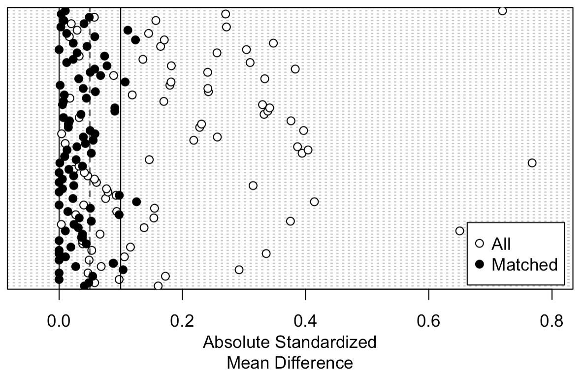

```{r setup, include=FALSE, warning=FALSE, message=FALSE}
knitr::opts_chunk$set(echo = FALSE, warning = FALSE, message = FALSE)

# Core
library(ISLR2)
library(tidyverse)
library(ggplot2)
library(knitr)
library(kableExtra)

library(MatchIt)        # Matching
library(factoextra)     # Clustering
library(tree)           # Classification & Trees
library(randomForest)
library(gbm)   
library(MASS)
library(glmnet)         # Regularization
library(e1071)          # SVM
library(pROC)           # Evaluation
```

```{r}
#| label: data set-up
#| echo: false
#| warning: false
#| message: false

data(Caravan)

# Convert Purchase to binary — required for matchit() and glmnet()
Caravan$Purchase <- ifelse(Caravan$Purchase == "Yes", 1, 0)
```


## Abstract

Predicting caravan insurance purchase among Dutch customers is a challenging classification problem due to severe class imbalance in the data. Since only 6% of 5,822 customers hold a policy, propensity score matching was applied to create 696 balanced observations, enabling valid classification analysis. Hierarchical clustering identified two socioeconomic customer segments, but identical purchase rates confirmed that unsupervised structure alone cannot predict purchase behavior. Eleven supervised classification methods were evaluated using AUC, with Ridge regression achieving the highest test AUC of 0.601 and Random Forest close behind at 0.585, with most methods clustering between 0.55 and 0.60. Boosting failed to find a stable sequential signal, and QDA could not be fit due to rank deficiency. Across variable selection methods, existing insurance engagement and sociodemographic characteristics emerged as the most reliable predictors. Overall, the results reveal a weak but non-random predictive signal, suggesting that aggregate zip-code derived predictors provide limited discriminatory power for predicting individual insurance decisions.


# Introduction

The purchase of caravan, or mobile home, insurance is a rare event with Dutch customers. This analysis seeks to determine whether caravan insurance purchase can be predicted from customer sociodemographic and insurance product characteristics. In the TIC Benchmark dataset compiled by Sentient Machine Research, only 6% of 5,822 Dutch customers hold a mobile home policy. This severe class imbalance, combined with 85 ordinal sociodemographic and insurance product predictors, presents a challenging classification problem that motivates careful methodological choices before any model is fit. When looking to analyze imbalanced data, all methods become invalidated because they will simply predict the majority class for everything and still appear highly accurate. In order to address the class imbalance, one-to-one propensity score matching (PSM) was used. After implementing this method to create a new balanced dataset, a valid analysis of the models predicting which Dutch customers are likely to buy caravan insurance was performed. Following PSM, unsupervised clustering was implemented to explore predictor structure before evaluating eleven classification methods spanning regularization, discriminant analysis, tree-based methods, and support vector machines. As this is a classification problem, the models were evaluated using Area Under the ROC Curve (AUC), which measures a model's ability to rank purchasers above non-purchasers regardless of classification threshold. This is a more meaningful metric than accuracy, given the original class imbalance. Across all methods, a weak and inconsistent predictive signal was found, suggesting that the sociodemographic and insurance product features provide limited discriminatory power for predicting caravan insurance purchase, even after addressing class imbalance through propensity score matching.


# EDA and Methods

The data contains 5,822 observations with 85 feature variables and a target variable. The target variable is a binary variable, either yes or no, as to whether the customer purchased the caravan insurance. The 85 feature variables are ordinal and fall into two main variable groups: sociodemographic and insurance product information. The sociodemographic variables are derived from zip codes (i.e., MOPLMIDD — medium education level, MGODGE — proportion with no religion, MINK7512 — income 75-122k) and insurance product variables capturing existing policy contributions and counts (i.e., PGEZONG — family accident insurance contribution, PPERSAUT — car policy contribution). Distributions of key predictors by purchase status (Appendix Figure A1) confirm that even the strongest predictors show minimal separation between purchasers and non-purchasers, foreshadowing the weak predictive signal observed across all methods. Also, sociodemographic data is derived from zip codes, so all customers in the same neighborhood share identical values on these 43 predictors, introducing substantial multicollinearity by construction. The distribution of the purchase pattern is extremely imbalanced. Only 6% of 5,822 Dutch customers hold a mobile home (caravan) policy, as seen in Figure 1 below. 


```{r}
#| label: eda-target-imbalance-report
#| echo: false
#| fig-align: center
#| out-width: "65%"
#| fig.cap: "Class Imbalance in Response Variable, Purchase"

# Calculate proportions
purchase_summary <- Caravan %>%
  mutate(Purchase_Label = ifelse(Purchase == 1, "Yes", "No")) %>%
  count(Purchase_Label) %>%
  mutate(Proportion = n / sum(n), Label = paste0(round(Proportion * 100, 1), "%"))

# Plot
ggplot(purchase_summary, aes(x = Purchase_Label, y = Proportion, fill = Purchase_Label)) +
  geom_col(width = 0.5) +
  geom_text(aes(label = Label), vjust = -0.5, size = 4) +
  scale_y_continuous(labels = scales::percent, limits = c(0, 1)) +
  scale_fill_manual(values = c("No" = "#636363", "Yes" = "#de2d26")) +
  labs(x = "Purchased Caravan Insurance", y = "Proportion") +
  theme_minimal() +
  theme(legend.position = "none", plot.title = element_text(face = "bold"))
```

Since the target variable is clearly imbalanced, propensity score matching (PSM) was used on the data to validate the modeling. Without performing PSM, any modeling results would be invalid. A classifier predicting 'No' for every observation would achieve approximately 94% accuracy, which is a meaningless result that reflects the class distribution rather than any learned signal. PSM will create a 50/50 matched sample based on the 85 feature variables, so the models are actually forced to learn what distinguishes purchasers from non-purchasers. For this data, PSM will match the 348 purchasers in the "Yes" category of the target variable to 348 non-purchasers from the 5,822 "No" category. It works by creating a logistic model on all the feature variables to model the probability of being a purchaser and calculate a propensity score. Then, it will use 1:1 nearest neighbor so each purchaser is matched to the non-purchaser with the closest propensity score based on all 85 predictors. This will produce a new balanced dataset with 696 matched observations, with 348 per target variable class (Yes/No). The balance of the new dataset is verified by looking at the Love plot (Figure 2). The standardized mean differences (SMDs) are close to 0 after matching. A common threshold is SMD < 0.1 for all variables, meaning the matched groups are well-balanced. A few matched observations sit around 0.1-0.15, which is right around the acceptable threshold; however, a perfect balance is rarely achieved with 85 predictors and nearest neighbor matching, and the improvement over the unmatched data is substantial. All supervised and unsupervised analyses that follow were performed on this matched dataset of 696 observations.


```{r}
#| label: psm-report
#| echo: false
#| fig-align: center
#| out-width: "65%"
#| fig.cap: "Love Plot - Covariate balance before and after PSM"

set.seed(42)
match_out <- matchit(Purchase ~ ., data = Caravan, method = "nearest", ratio = 1)
caravan_matched <- match.data(match_out)

# Clean working dataset — drop matchit metadata columns
caravan_matched <- caravan_matched %>% 
  dplyr::select(-distance, -weights, -subclass)

# Summary PSM
smd_data <- summary(match_out, un = TRUE)

# love plot
# plot(summary(match_out), abs = TRUE)

# Plot for balanced matching 

```

To explore the structure of the matched predictor space independently of the response variable, Purchase was excluded, and hierarchical clustering was applied using Euclidean distance and complete linkage to create a dendrogram (Figure 3). Euclidean distance measures straight-line distances between observations across all predictors, and complete linkage defines cluster distance as the maximum distance between any two points across clusters, producing compact, well-separated clusters. The scree plot (Appendix Figure A2) showed a sharp drop in merge height from k=1 to k=2, with the curve flattening after that. This indicated two natural groupings in the predictor space, suggesting the matched customer population divides into two meaningfully distinct segments. 

```{r}
#| label: hierarchical-clustering-report
#| echo: false
#| fig-align: center
#| out-width: "65%"
#| fig.cap: "Hierarchical clustering dendrogram of matched Caravan data (k = 2)"

# Hierarchical clustering using Euclidean distance and complete linkage
hclust_out <- hclust(dist(caravan_matched %>% 
                            dplyr::select(-Purchase),
                           method = "euclidean"), 
                     method = "complete")

# Dendrogram
fviz_dend(hclust_out,
          k = 2,
          k_colors = c("#636363", "#de2d26"),
          color_labels_by_k = TRUE,
          show_labels = FALSE,
          main = "Hierarchical Clustering of Matched Caravan Data",
          ylab = "Height")

# Cut tree into clusters and add to dataset
caravan_matched$cluster <- cutree(hclust_out, k = 2)
```

The two clusters are primarily distinguished by socioeconomic status (Appendix Table A1). People grouped into cluster 1 tend to have lower purchasing power, lower education, be renters, be national health service users, and be of a lower social class. People grouped into cluster 2 tend to have higher purchasing power, higher status occupations, be homeowners, have private health insurance, and be of a higher social class. Despite these socioeconomic differences, both clusters showed nearly identical purchase rates (Cluster 1: 50.1%, n = 349; Cluster 2: 49.9%, n = 347), confirming that the matched dataset is balanced across segments. The natural structure in the predictor space does not meaningfully separate purchasers from non-purchasers despite the distinct socioeconomic profiles identified. This motivates why supervised methods are needed, as unsupervised methods alone are not sufficient to predict purchase behavior.


```{r}
#| label: cluster-scree-report
#| include: false

# Scree plot to justify number of clusters
height_data <- data.frame(k = 1:20, height = sort(hclust_out$height, decreasing = TRUE)[1:20])

ggplot(height_data, aes(x = k, y = height)) +
  geom_line() + geom_point() +
  labs(title = "Hierarchical Clustering Scree Plot", x = "Number of Clusters", y = "Merge Height") +
  theme_minimal()
```

```{r}
#| label: cluster-profile-report
#| include: false

cluster_profile <- caravan_matched %>%
  group_by(cluster) %>%
  summarise(
    n = n(),
    purchase_rate = mean(Purchase),
    .groups = "drop"
  ) %>%
  mutate(purchase_rate = scales::percent(purchase_rate, accuracy = 0.1))

kable(cluster_profile,
      col.names = c("Cluster", "N", "Purchase Rate"),
      caption = "Cluster Size and Purchase Rate") %>%
  kable_styling(bootstrap_options = "striped", full_width = FALSE)
```

```{r}
#| label: cluster-characterization-report
#| include: false

# Find variables with largest difference between clusters
cluster_means <- caravan_matched %>%
  group_by(cluster) %>%
  summarise(across(-Purchase, mean), .groups = "drop")

# Calculate difference between clusters for each variable
cluster_diff <- data.frame(
  variable = names(cluster_means)[-1],
  diff = abs(as.numeric(cluster_means[1, -1]) - 
             as.numeric(cluster_means[2, -1]))
) %>%
  arrange(desc(diff)) %>%
  head(10)

kable(cluster_diff, 
      col.names = c("Variable", "Absolute Mean Difference"),
      digits = 3,
      caption = "Top 10 Variables Distinguishing Clusters") %>%
  kable_styling(bootstrap_options = "striped", full_width = FALSE)
```

All supervised classification methods were applied to the matched dataset of 696 observations using an 80/20 train/test split, with all methods evaluated on the same held-out test set for direct comparability. Methods span the bias-variance tradeoff spectrum, from high-bias low-variance approaches like LDA and logistic regression, to low-bias high-variance approaches like single trees, with regularization and ensemble methods representing deliberate attempts to find a better balance. Ten-fold cross-validation was conducted within the training set for all hyperparameter tuning, and the test set was only touched once per method for final evaluation. All methods are evaluated using AUC on the held-out test set, with the ROC curves presented together in the Results section.


```{r}
#| label: train-test-split-report
#| include: false

set.seed(42)

n <- nrow(caravan_matched)
train_idx <- sample(1:n, size = floor(0.8 * n))

train_data <- caravan_matched[train_idx, ]
test_data  <- caravan_matched[-train_idx, ]

# Separate X and y for glmnet methods
X_train <- model.matrix(Purchase ~ . - cluster - 1, data = train_data)
X_test  <- model.matrix(Purchase ~ . - cluster - 1, data = test_data)
y_train <- train_data$Purchase
y_test  <- test_data$Purchase
```

The first supervised method applied is a single decision tree to establish an interpretable baseline. A single tree was built and pruned using 10-fold cross-validation (Figure 4), yielding an optimal size of one split and two terminal nodes, both predicting no purchase. This is notable given the balanced 50/50 class distribution after PSM, as the tree failed to learn any meaningful separation despite equal class representation. The tree splits customers on contribution to car policies (PPERSAUT < 6.5). The interpretation is that customers with higher car insurance contributions are more likely to be vehicle owners with broader insurance engagement, making them more likely candidates for caravan insurance. Despite this interpretable split, the pruned tree achieves an AUC of 0.508, barely above random chance, confirming it is too simple to capture the weak signal in this data and motivating the use of ensemble methods.


```{r}
#| label: single-tree-report
#| echo: false
#| fig-align: center
#| out-width: "50%"
#| fig-height: 3
#| fig.pos: "H"
#| fig.cap: "Pruned classification tree (k = 2) with single split on PPERSAUT."

# Keep only the pruned tree plot
tree_fit <- tree(factor(Purchase) ~ . - cluster, data = train_data)
set.seed(42)
tree_cv <- cv.tree(tree_fit, FUN = prune.misclass, K = 10)
optimal_size <- tree_cv$size[which.min(tree_cv$dev)]
tree_pruned <- prune.misclass(tree_fit, best = optimal_size)
plot(tree_pruned)
text(tree_pruned, pretty = 0, cex = 0.7)

tree_probs <- predict(tree_pruned, newdata = test_data, type = "vector")[, 2]
tree_roc <- roc(y_test, tree_probs)
tree_auc <- auc(tree_roc)
```

Three ensemble methods were applied to address the limitations of the single decision tree: bagging, random forest, and boosting. Bagging was introduced as a method to reduce variance, as it takes the average of many trees using all of the predictors. Random Forest builds upon the bagging method by restricting split predictor candidates to decorrelate the trees. It was fit with 500 trees and mtry = $\sqrt{p} \approx 9$. Lastly, boosting builds trees sequentially, each correcting the errors of the previous. These methods resulted in bagging achieving AUC = 0.583, Random Forest AUC = 0.585, and Boosting AUC = 0.450. Bagging and Random Forest show modest improvement over single tree, and are nearly identical to each other, indicating the correlated predictors limit decorrelation benefit. Boosting, however, failed to find a stable sequential signal across multiple configurations. Shrinkage values of 0.01, 0.001, and 0.0001 with interaction depths of 1-3 were all attempted, but CV consistently selected only 1-3 trees regardless of configuration. This is likely because boosting requires a learnable sequential structure in the data so that it can improve from the errors. When the signal is this weak, the algorithm has nothing reliable to learn sequentially. The cross-validation error starts increasing almost immediately after tree 1-3 (Appendix Figure A5), meaning adding more trees is making things worse, not better. Random Forest variable importance identified contribution to disability insurance policies (PWAOREG) and contribution to family accidents insurance policies (PGEZONG) as the strongest predictors. Both are insurance product contribution variables, meaning customers who already contribute to disability insurance and family accident insurance are more likely to purchase caravan insurance. This fits the broader pattern seen across methods, as people who are already active insurance buyers tend to buy more insurance.


```{r}
#| label: tree-ensembles-report
#| include: false

# Bagging (mtry = all predictors)
set.seed(42)
bag_fit <- randomForest(factor(Purchase) ~ . - cluster,
                        data = train_data,
                        mtry = ncol(train_data) - 2,  # all predictors minus Purchase and cluster
                        ntree = 500,
                        importance = TRUE)

bag_probs <- predict(bag_fit, newdata = test_data, type = "prob")[, 2]
bag_roc <- roc(y_test, bag_probs)
bag_auc <- auc(bag_roc)
cat("Bagging AUC:", round(bag_auc, 3), "\n")

# Random Forest (mtry = sqrt(p))
set.seed(42)
rf_fit <- randomForest(factor(Purchase) ~ . - cluster,
                       data = train_data,
                       mtry = floor(sqrt(ncol(train_data) - 2)),
                       ntree = 500,
                       importance = TRUE)

rf_probs <- predict(rf_fit, newdata = test_data, type = "prob")[, 2]
rf_roc <- roc(y_test, rf_probs)
rf_auc <- auc(rf_roc)
cat("Random Forest AUC:", round(rf_auc, 3), "\n")

varImpPlot(rf_fit, n.var = 15, main = "")

# Boosting
set.seed(42)
boost_fit <- gbm(Purchase ~ . - cluster,
                 data = train_data,
                 distribution = "bernoulli",
                 n.trees = 5000,
                 interaction.depth = 1,
                 shrinkage = 0.0001,
                 cv.folds = 10,
                 verbose = FALSE)

best_trees <- gbm.perf(boost_fit, method = "cv", plot.it = FALSE)
cat("Best number of trees:", best_trees, "\n")

boost_probs <- predict(boost_fit, newdata = test_data,
                       n.trees = best_trees,
                       type = "response")

boost_roc <- roc(y_test, boost_probs)
boost_auc <- auc(boost_roc)
cat("Boosting AUC:", round(boost_auc, 3), "\n")
```

Logistic regression was applied as a baseline classifier, modeling the log-odds of purchase as a linear combination of all 85 predictors. The model produced several NA coefficients due to perfect multicollinearity among predictors, along with extreme coefficient estimates (e.g., AWAOREG = 378, AWABEDR = 105), indicating severe overfitting. The resulting test AUC of 0.564 is slightly above random chance (0.5), confirming the model has little predictive power. This result directly motivates regularization methods since Ridge and Lasso constrain coefficient estimates, handle multicollinearity, and should produce a more stable and better-performing model. This is the expected behavior of logistic regression when p is large relative to n.


```{r}
#| label: logistic-regression-report
#| include: false

# Fit logistic regression on training data
logistic_fit <- glm(Purchase ~ . - cluster, 
                    data = train_data, 
                    family = binomial)
summary(logistic_fit)

# Predicted probabilities on test data
logistic_probs <- predict(logistic_fit, 
                          newdata = test_data, 
                          type = "response")

# ROC and AUC
logistic_roc <- roc(y_test, logistic_probs)
logistic_auc <- auc(logistic_roc)

# Plot ROC
plot(logistic_roc, 
     main = paste("Logistic Regression ROC (AUC =", 
                  round(logistic_auc, 3), ")"),
     col = "#de2d26")
```

To address the instability of logistic regression, Ridge and Lasso regularization were applied as penalized logistic regression models with the regularization parameter lambda selected via 10-fold cross-validation. Ridge shrinks all coefficients toward zero without eliminating any entirely, handling multicollinearity and addressing the bias-variance tradeoff by accepting some bias through shrinkage in exchange for reduced variance, which is particularly beneficial when p is large relative to n. Lasso zeroes some coefficients entirely, thus performing variable selection. Ridge produced a test AUC of 0.601, while Lasso, manually tuned to retain 10 variables, achieved AUC = 0.571. Lasso's CV-selected lambda zeroed all coefficients, indicating the penalty required to minimize cross-validation error was large enough to eliminate every predictor entirely. This reflects the weak and diffuse signal in the data, and with no single variable strongly predictive, Lasso's aggressive shrinkage removed everything rather than selecting a meaningful subset. A lambda was manually selected along the regularization path at the point where exactly 10 variables entered the model (Appendix Figure A4), allowing Lasso's variable selection property to be demonstrated while acknowledging that the CV result itself is informative about signal strength. Lasso selected variables centered on existing insurance contributions and sociodemographic factors, including PGEZONG (family accident insurance contribution) and MOPLMIDD (medium education level). Ridge outperformed Lasso because severe multicollinearity with a weak signal favors uniform shrinkage over variable selection. Forward stepwise selection was also applied as a subset selection method, as best subset selection and backward stepwise were not feasible for this data. Starting from a null model and adding variables one at a time based on AIC improvement, forward stepwise selected 6 variables and achieved AUC = 0.555. Notably, four of the six selected variables overlapped with Lasso's selected predictors, providing convergent evidence that the same small subset of variables carries the most reliable signal in this data.


```{r}
#| label: ridge-lasso-report
#| include: false

# Ridge regression (alpha = 0)
set.seed(42)
ridge_cv <- cv.glmnet(X_train, y_train, alpha = 0, family = "binomial",
                      nfolds = 10)

ridge_best_lambda <- ridge_cv$lambda.min

ridge_fit <- glmnet(X_train, y_train, alpha = 0, family = "binomial",
                    lambda = ridge_best_lambda)

ridge_probs <- predict(ridge_fit, newx = X_test, type = "response")
ridge_roc <- roc(y_test, as.vector(ridge_probs))
ridge_auc <- auc(ridge_roc)

# Lasso (alpha = 1)
set.seed(42)
lasso_cv <- cv.glmnet(X_train, y_train, alpha = 1, family = "binomial",
                      nfolds = 10)

lasso_best_lambda <- lasso_cv$lambda.min

lasso_fit <- glmnet(X_train, y_train, alpha = 1, family = "binomial",
                    lambda = lasso_best_lambda)

lasso_probs <- predict(lasso_fit, newx = X_test, type = "response")
lasso_roc <- roc(y_test, as.vector(lasso_probs))
lasso_auc <- auc(lasso_roc)

# Plot CV curves
par(mfrow = c(1, 2))
plot(ridge_cv, main = "Ridge CV")
plot(lasso_cv, main = "Lasso CV")
par(mfrow = c(1, 1))

# Compare AUCs
cat("Ridge AUC:", round(ridge_auc, 3), "\n")
cat("Lasso AUC:", round(lasso_auc, 3), "\n")
cat("Ridge best lambda:", round(ridge_best_lambda, 4), "\n")
cat("Lasso best lambda:", round(lasso_best_lambda, 4), "\n")

# Lasso selected variables
lasso_coefs <- coef(lasso_fit)
n_selected <- sum(lasso_coefs != 0) - 1  # subtract intercept
cat("Lasso variables selected:", n_selected, "of 85\n")
```

```{r}
#| label: lasso-fix-report
#| include: false

# Since Lasso above zeroed out all predictors
# Check how many variables selected across lambda path
plot(lasso_fit_path <- glmnet(X_train, y_train, alpha = 1, family = "binomial"),
     xvar = "lambda", label = FALSE, main = "Lasso Coefficient Path")

# Try lambda that gives ~20-30 variables
lasso_cv_check <- cv.glmnet(X_train, y_train, alpha = 1, family = "binomial",
                             nfolds = 10)

# Check both lambda options
cat("lambda.min variables:", sum(coef(lasso_cv_check, 
                s = lasso_cv_check$lambda.min) != 0) - 1, "\n")
cat("lambda.1se variables:", sum(coef(lasso_cv_check, 
                s = lasso_cv_check$lambda.1se) != 0) - 1, "\n")
```

```{r}
#| label: lasso-manual-report
#| include: false

# Find lambda that gives ~10 variables
lasso_lambda_10 <- lasso_cv_check$lambda[
  which(lasso_cv_check$nzero >= 10)[1]]

lasso_fit_manual <- glmnet(X_train, y_train, alpha = 1, family = "binomial",
                            lambda = lasso_lambda_10)

lasso_probs_manual <- predict(lasso_fit_manual, newx = X_test, type = "response")
lasso_roc_manual <- roc(y_test, as.vector(lasso_probs_manual))
lasso_auc_manual <- auc(lasso_roc_manual)

cat("Lasso AUC (manual lambda):", round(lasso_auc_manual, 3), "\n")
cat("Lambda used:", round(lasso_lambda_10, 4), "\n")
cat("Variables selected:", sum(coef(lasso_fit_manual) != 0) - 1, "\n")

# Extract selected variables
lasso_coef_manual <- coef(lasso_fit_manual)
lasso_selected <- data.frame(
  Variable = rownames(lasso_coef_manual),
  Coefficient = as.vector(lasso_coef_manual)
) %>%
  filter(Coefficient != 0, Variable != "(Intercept)") %>%
  arrange(desc(abs(Coefficient)))

kable(lasso_selected,
      digits = 4,
      caption = "Lasso Selected Variables") %>%
  kable_styling(bootstrap_options = "striped", full_width = FALSE)
```

```{r}
#| label: stepwise-selection-report
#| include: false

# Start from a null model and full model for stepwise
null_model <- glm(Purchase ~ 1, data = train_data, family = binomial)
full_model <- glm(Purchase ~ . - cluster, data = train_data, family = binomial)

# Forward stepwise
forward_fit <- step(null_model,
                    scope = list(lower = null_model, 
                                 upper = full_model),
                    direction = "forward",
                    trace = 0)  # trace=0 suppresses step-by-step output

# Get selected variables
forward_vars <- names(coef(forward_fit))[-1]  # remove intercept
cat("Forward stepwise selected", length(forward_vars), "variables:\n")
cat(forward_vars, "\n")

# Predicted probabilities
forward_probs <- predict(forward_fit, newdata = test_data, type = "response")

forward_roc <- roc(y_test, forward_probs)
forward_auc <- auc(forward_roc)
cat("Forward Stepwise AUC:", round(forward_auc, 3), "\n")
```

Linear Discriminant Analysis (LDA) and Quadratic Discriminant Analysis (QDA) were applied as generative classifiers, assuming Gaussian class distributions to model the boundary between purchasers and non-purchasers. LDA assumes a shared covariance matrix across both classes, making it feasible with limited observations, whereas QDA estimates a separate covariance matrix per class, requiring far more data. For this data, LDA was successfully fit after removing 8 constant variables, resulting in a test AUC of 0.555. The eight variables were found to be constant within at least one class after the 80/20 split, a consequence of the sparse ordinal structure, and were removed prior to fitting. QDA returned an error message of rank deficiency, meaning that it cannot calculate a covariance matrix for each class. With 77 predictors, QDA must estimate a full covariance matrix per class, requiring far more parameters than the 348 observations per class can support, making it fundamentally inappropriate for this data.


```{r}
#| label: lda-report
#| include: false

# Remove constant variables within groups
purchase_groups <- train_data$Purchase

# Find variables with near-zero variance within either class
nzv_check <- train_data %>%
  dplyr::select(-Purchase, -cluster) %>%
  mutate(group = purchase_groups) %>%
  group_by(group) %>%
  summarise(across(everything(), var)) %>%
  dplyr::select(-group)

constant_vars <- names(which(colSums(nzv_check == 0, na.rm = TRUE) > 0))
cat("Removing constant variables:", constant_vars, "\n")

# LDA without constant variables
lda_formula <- as.formula(
  paste("Purchase ~", 
        paste(setdiff(names(train_data %>% 
                dplyr::select(-Purchase, -cluster)), 
                constant_vars), collapse = " + ")))

lda_fit <- lda(lda_formula, data = train_data)
lda_probs <- predict(lda_fit, newdata = test_data)$posterior[, 2]
lda_roc <- roc(y_test, lda_probs)
lda_auc <- auc(lda_roc)
cat("LDA AUC:", round(lda_auc, 3), "\n")
```

The last modeling method is support vector machines (SVM), which were applied with both linear and radial kernels to find the maximum margin hyperplane separating purchasers from non-purchasers. Before running the SVM, scaling of the predictors is required, otherwise, unscaled variables with larger ranges dominate the results. Along with scaling, four zero-variance predictors were removed from the data in order for the SVM to run properly, the same variables found to be constant within classes during LDA fitting. With the linear kernel, the cost parameter was tuned via 10-fold cross-validation, with the best cost = 0.01, indicating a very wide margin with many violations tolerated and reflecting the absence of a clean linear boundary. For the radial kernel, both cost and gamma parameters were tuned jointly via cross-validation, with best cost = 0.1 and gamma = 0.001. The small gamma value indicates a nearly global, smooth kernel, effectively approximating a linear boundary. The Linear SVM produced a test AUC of 0.571, and the Radial SVM produced a test AUC of 0.576, which are nearly identical. The near-identical performance suggests there is no meaningful nonlinear structure to exploit, which is consistent with other methods.


```{r}
#| label: svm-report
#| include: false

# Remove zero-variance columns before scaling
X_train_clean <- X_train[, apply(X_train, 2, var) > 0]
X_test_clean  <- X_test[, colnames(X_train_clean)]

# Rescale clean data
X_train_scaled <- scale(X_train_clean)
X_test_scaled  <- scale(X_test_clean,
                         center = attr(X_train_scaled, "scaled:center"),
                         scale  = attr(X_train_scaled, "scaled:scale"))

svm_train <- data.frame(X_train_scaled, Purchase = factor(y_train))
svm_test  <- data.frame(X_test_scaled,  Purchase = factor(y_test))

cat("Columns remaining:", ncol(X_train_clean), "\n")

# Linear SVM with cleaned scaled data
set.seed(42)
svm_linear_tune <- tune(svm, Purchase ~ ., data = svm_train, kernel = "linear",
                        ranges = list(cost = c(0.01, 0.1, 1, 10)),
                        tunecontrol = tune.control(cross = 10))

cat("Best linear cost:", svm_linear_tune$best.parameters$cost, "\n")

svm_linear_fit <- svm_linear_tune$best.model
svm_linear_probs <- predict(svm_linear_fit, newdata = svm_test, decision.values = TRUE)
svm_linear_roc <- roc(y_test, as.numeric(attributes(svm_linear_probs)$decision.values))
svm_linear_auc <- auc(svm_linear_roc)
cat("Linear SVM AUC:", round(svm_linear_auc, 3), "\n")

# Radial SVM
set.seed(42)
svm_radial_tune <- tune(svm, Purchase ~ ., data = svm_train, kernel = "radial",
                        ranges = list(cost  = c(0.1, 1, 10), gamma = c(0.001, 0.01, 0.1)),
                        tunecontrol = tune.control(cross = 10))

cat("Best radial cost:", svm_radial_tune$best.parameters$cost, "\n")
cat("Best radial gamma:", svm_radial_tune$best.parameters$gamma, "\n")

svm_radial_fit <- svm_radial_tune$best.model
svm_radial_probs <- predict(svm_radial_fit, newdata = svm_test, decision.values = TRUE)
svm_radial_roc <- roc(y_test, as.numeric(attributes(svm_radial_probs)$decision.values))
svm_radial_auc <- auc(svm_radial_roc)
cat("Radial SVM AUC:", round(svm_radial_auc, 3), "\n")
```


Several methods from the course were not applied due to the ordinal nature of the predictors or the binary nature of the response. Since linear regression predicts continuous values and can produce fitted values outside the 0 to 1 range, it was not applied as Purchase is a binary response variable, making logistic regression the appropriate baseline classifier. Splines, polynomial regression, and GAMs were not applied as they require continuous inputs, which is not satisfied by the ordinal predictors in this dataset. PCR and PLS were also not applied since both methods are designed for continuous predictors and continuous response variables, reducing dimensions via linear combinations of predictors before fitting a regression model. For unsupervised methods, PCA and K-means clustering assume continuous variables and require computing means and Euclidean distances, making them less appropriate than hierarchical clustering for this data. Best subset selection is computationally infeasible with 85 predictors ($2^{85}$ models). Backward stepwise was also avoided as it requires fitting the full model first, which produced unstable estimates with extreme coefficients and NA values due to perfect multicollinearity among the 85 predictors. KNN is a distance-based classification method, but unreliable with 85 sparse ordinal predictors.


# Results

Figure 5 below presents the ROC curves for the classification methods applied, along with their AUC values. Ridge regression achieved the highest test AUC of 0.601, marginally ahead of Random Forest (0.585), though given the test set size of 140 observations this difference should be interpreted cautiously rather than as a definitive ranking. Most of the other methods produced AUC scores between 0.55 and 0.60, revealing the weak but non-random predictive signal present in the data. Outside of that range, boosting is a clear outlier, producing an AUC of 0.450. This was the only method to fall below random chance (AUC = 0.5), indicating it found no stable signal to learn from. The single tree performed weakest among the remaining methods at AUC = 0.508, barely above random chance, reflecting its inability to capture the weak signal with a single split. The near-identical performance of linear and nonlinear methods, such as Linear SVM (AUC = 0.571) and Radial SVM (AUC = 0.576), suggests the decision boundary is approximately linear, with no meaningful nonlinear structure to exploit. QDA failed entirely due to rank deficiency and is excluded from the comparison. 

```{r}
#| label: model-comparison-report
#| echo: false
#| fig-align: center
#| out-width: "75%"
#| fig.cap: "ROC curves for all  classification methods with AUC values"

# AUC Summary Table
auc_summary <- data.frame(
  Method = c("Logistic Regression", "Ridge", "Lasso", "Forward Stepwise", 
             "LDA", "Single Tree", "Bagging", "Random Forest", "Boosting", 
             "Linear SVM", "Radial SVM"),
  AUC = c(round(logistic_auc, 3), round(ridge_auc, 3),
           round(lasso_auc, 3), round(forward_auc, 3),
           round(lda_auc, 3), round(tree_auc, 3),
           round(bag_auc, 3), round(rf_auc, 3),
           round(boost_auc, 3),
           round(svm_linear_auc, 3), round(svm_radial_auc, 3))
) %>%
  arrange(desc(AUC))

# ROC curve data
roc_list <- list(
  "Logistic"      = logistic_roc,
  "Ridge"         = ridge_roc,
  "Lasso"         = lasso_roc_manual,
  "Forward SW"    = forward_roc,
  "LDA"           = lda_roc,
  "Single Tree"   = tree_roc,
  "Bagging"       = bag_roc,
  "Random Forest" = rf_roc,
  "Boosting"      = boost_roc,
  "Linear SVM"    = svm_linear_roc,
  "Radial SVM"    = svm_radial_roc
)

# Build data frame with AUC in legend labels
roc_df <- do.call(rbind, lapply(names(roc_list), function(name) {
  r <- roc_list[[name]]
  auc_val <- round(auc(r), 3)
  data.frame(
    Method = paste0(name, " (AUC = ", auc_val, ")"),
    FPR = 1 - r$specificities,
    TPR = r$sensitivities,
    auc_val = auc_val
  )
}))

# Order legend by AUC descending
roc_df$Method <- factor(roc_df$Method, 
                         levels = unique(roc_df$Method[order(-roc_df$auc_val)]))

# Highlight Ridge
roc_df$is_ridge <- grepl("Ridge", roc_df$Method)

ggplot(roc_df, aes(x = FPR, y = TPR, color = Method, 
                    linewidth = is_ridge)) +
  geom_line() +
  scale_linewidth_manual(values = c("TRUE" = 1.5, "FALSE" = 0.5),
                          guide = "none") +
  geom_abline(slope = 1, intercept = 0,
              linetype = "dashed", color = "gray50") +
  scale_x_continuous(limits = c(0, 1)) +
  scale_y_continuous(limits = c(0, 1)) +
  labs(title = "ROC Curves - All Methods",
       x = "False Positive Rate (1 - Specificity)",
       y = "True Positive Rate (Sensitivity)",
       color = NULL) +
  theme_minimal() +
  theme(legend.position = "right",
        legend.text = element_text(size = 10),
        plot.title = element_text(face = "bold"))
```

Across variable selection methods, a consistent subset of predictors emerged as most informative: family accident insurance contribution (PGEZONG), car policy contribution (PPERSAUT), medium education level (MOPLMIDD), no religion proportion (MGODGE), and income 75-122k (MINK7512), suggesting these variables carry the most reliable signal in the data. These variables appeared consistently across Lasso, forward stepwise, and Random Forest variable importance, providing convergent evidence across very different methods that existing insurance engagement and sociodemographic characteristics are the strongest predictors of caravan insurance purchase.


# Discussion/Limitations

Across all methods, the results reveal a weak but non-random predictive signal for caravan insurance purchase, with AUCs ranging from 0.555 to 0.601, suggesting that the available sociodemographic and insurance product features provide limited but non-trivial discriminatory power. The use of propensity score matching was necessary to create a balanced matched dataset, but it reduced the sample size substantially (from 5,822 originally to 696 matched), which limits the power of the methods. Additionally, predictive performance was evaluated on a matched population rather than the general population. PSM intentionally removes the most dissimilar non-purchasers, meaning the AUC estimates reflect performance on high-similarity cases rather than the full customer base, which is an important consideration for real-world deployment. Additionally, a fully cross-validated evaluation would yield more stable AUC estimates given the modest sample size of 696 observations after matching. The ordinal structure of all 85 predictors created challenges throughout, including constant variables requiring removal prior to LDA and SVM fitting, and Euclidean distance assumptions that are suboptimal for ordinal data. Hierarchical clustering found meaningful socioeconomic customer segments, but the purchase rates are nearly identical, suggesting the segments do not predict purchase behavior. The existence of structure in the predictor space does not imply predictability of the response. Ridge regression achieved the highest AUC of 0.601, marginally ahead of Random Forest (AUC = 0.585). Its shrinkage directly addresses the multicollinearity built into the zip-code derived predictors, suggesting that existing insurance behavior and sociodemographic factors are modest predictors of caravan insurance purchase. Future work could explore individual-level rather than zip-code derived predictors, ordinal-appropriate methods such as ordinal logistic regression, and interaction terms between insurance product variables, which may better capture the mechanisms driving caravan insurance purchase.


# Appendix

**Figure A1:** Distribution of key predictors by purchase status.

```{r}
#| label: eda-predictors-appendix
#| echo: false
#| fig-align: center

# Top predictors identified consistently across methods
top_vars <- c("PGEZONG", "PPERSAUT", "MOPLMIDD", "MGODGE", "MINK7512")
top_labels <- c("PGEZONG" = "Family Accident Insurance Contribution",
                "PPERSAUT" = "Private Accident Insurance Contribution", 
                "MOPLMIDD" = "Middle Education Level",
                "MGODGE" = "No Religion",
                "MINK7512" = "Income 75-122k")

# Reshape for plotting
eda_plot_data <- caravan_matched %>%
  dplyr::select(all_of(top_vars), Purchase) %>%
  mutate(Purchase = factor(Purchase, labels = c("No", "Yes"))) %>%
  pivot_longer(cols = all_of(top_vars),
               names_to = "Variable",
               values_to = "Value") %>%
  mutate(Variable = recode(Variable, !!!top_labels))

# Bar charts faceted by variable
ggplot(eda_plot_data, aes(x = factor(Value), fill = Purchase)) +
  geom_bar(position = "dodge") +
  facet_wrap(~ Variable, scales = "free_x", ncol = 2) +
  scale_fill_manual(values = c("No" = "#636363", "Yes" = "#de2d26")) +
  labs(title = "Distribution of Key Predictors by Purchase Status",
       x = "Value", y = "Count", fill = "Purchase") +
  theme_minimal() +
  theme(strip.text = element_text(size = 8))
```


**Figure A2:** Hierarchical Clustering Dendrogram Scree Plot

```{r}
#| label: cluster-scree-apendix
#| echo: false
#| fig-align: center
#| out-width: "65%"

# Scree plot to justify number of clusters
height_data <- data.frame(k = 1:20, height = sort(hclust_out$height, 
                                                  decreasing = TRUE)[1:20])

ggplot(height_data, aes(x = k, y = height)) +
  geom_line() +
  geom_point() +
  labs(title = "Hierarchical Clustering Scree Plot",
       x = "Number of Clusters",
       y = "Merge Height") +
  theme_minimal()
```


**Figure A3:** Random Forest variable importance — top 15 predictors by mean decrease in accuracy

```{r}
#| label: RF-var-importance-appendix
#| echo: false
#| fig-align: center
#| out-width: "65%"

varImpPlot(rf_fit, n.var = 15, main = "")
```

**Figure A4:** Lasso regularization path showing coefficient entry as lambda decreases.

```{r}
#| label: lasso-path-appendix
#| echo: false
#| fig-align: center
#| out-width: "65%"

plot(glmnet(X_train, y_train, alpha = 1, family = "binomial"),
     xvar = "lambda", label = FALSE,
     main = "")
```


**Figure A5:** Boosting cross-validation deviance — training deviance (black) decreasing while CV deviance (green) increases immediately, indicating no stable sequential signal.

```{r}
#| label: boosting-plot-appendix
#| echo: false
#| fig-align: center
#| out-width: "65%"

set.seed(42)
boost_fit_plot <- gbm(Purchase ~ . - cluster,
                      data = train_data,
                      distribution = "bernoulli",
                      n.trees = 2000,
                      interaction.depth = 2,
                      shrinkage = 0.001,
                      cv.folds = 10,
                      verbose = FALSE)

invisible(gbm.perf(boost_fit_plot, method = "cv", plot.it = TRUE))
```


**Table A1:** Hierarchical Clustering Characterization - Top 10 Variables Distinguishing Clusters

```{r}
#| label: cluster-characterization-appendix
#| echo: false
#| fig-align: center
#| out-width: "65%"

cluster_diff_labeled <- cluster_diff %>%
  mutate(Description = case_when(
    variable == "MOSTYPE"  ~ "Customer subtype",
    variable == "MOSHOOFD" ~ "Customer main type",
    variable == "MKOOPKLA" ~ "Purchasing power class",
    variable == "MOPLLAAG" ~ "Lower education level",
    variable == "MSKC"     ~ "Social class C",
    variable == "MBERHOOG" ~ "High status occupation",
    variable == "MHKOOP"   ~ "Home owners",
    variable == "MHHUUR"   ~ "Rented house",
    variable == "MZFONDS"  ~ "National health service",
    variable == "MZPART"   ~ "Private health insurance",
    TRUE ~ variable
  ))

kable(cluster_diff_labeled %>% 
        dplyr::select(variable, Description, diff),
      col.names = c("Variable", "Description", "Absolute Mean Difference"),
      digits = 3,
      caption = NULL,
      align = c("l", "l", "c")) %>%
  kable_styling(bootstrap_options = "striped", full_width = FALSE)
```


# Supplement - Raw Code

```{r}
#| label: libraries and data set-up
#| echo: true
#| eval: false
#| warning: false
#| message: false

# Core
library(ISLR2); library(tidyverse); library(ggplot2); library(knitr); 
library(kableExtra)
# Matching
library(MatchIt)
# Clustering
library(factoextra)
# Classification & Trees
library(tree); library(randomForest); library(gbm); library(MASS)
# Regularization
library(glmnet)
#SVM 
library(e1071)
# Evaluation
library(pROC)           

# Read in data
data(Caravan)

# Convert Purchase to binary — required for matchit() and glmnet()
Caravan$Purchase <- ifelse(Caravan$Purchase == "Yes", 1, 0)
```


```{r}
#| label: eda-imbalance
#| eval: false
#| echo: true

# Calculate proportions
purchase_summary <- Caravan %>%
  mutate(Purchase_Label = ifelse(Purchase == 1, "Yes", "No")) %>%
  count(Purchase_Label) %>%
  mutate(Proportion = n / sum(n),
         Label = paste0(round(Proportion * 100, 1), "%"))

# Plot
ggplot(purchase_summary, aes(x = Purchase_Label, y = Proportion, 
                              fill = Purchase_Label)) +
  geom_col(width = 0.5) +
  geom_text(aes(label = Label), vjust = -0.5, size = 4) +
  scale_y_continuous(labels = scales::percent, limits = c(0, 1)) +
  scale_fill_manual(values = c("No" = "#636363", "Yes" = "#de2d26")) +
  labs(title = "Class Imbalance in Purchase Response",
       x = "Purchased Caravan Insurance",
       y = "Proportion") +
  theme_minimal() +
  theme(legend.position = "none")
```

```{r}
#| label: propensity score matching
#| eval: false
#| echo: true

set.seed(42)

match_out <- matchit(Purchase ~ .,
                     data = Caravan,
                     method = "nearest",
                     ratio = 1)

caravan_matched <- match.data(match_out)

# Clean working dataset — drop matchit metadata columns
caravan_matched <- caravan_matched %>% 
  dplyr::select(-distance, -weights, -subclass)
```

```{r}
#| label: psm-check
#| eval: false
#| echo: true

# Cleaner version for report — just show SMD distribution
smd_data <- summary(match_out, un = TRUE)
smd_data

# For appendix — full love plot
plot(summary(match_out), abs = TRUE)
```

```{r}
#| label: eda-predictors
#| eval: false
#| echo: true

# Top predictors identified consistently across methods
top_vars <- c("PGEZONG", "PPERSAUT", "MOPLMIDD", "MGODGE", "MINK7512")
top_labels <- c("PGEZONG" = "Family Accident Insurance Contribution",
                "PPERSAUT" = "Private Accident Insurance Contribution", 
                "MOPLMIDD" = "Middle Education Level",
                "MGODGE" = "No Religion",
                "MINK7512" = "Income 75-122k")

# Reshape for plotting
eda_plot_data <- caravan_matched %>%
  dplyr::select(all_of(top_vars), Purchase) %>%
  mutate(Purchase = factor(Purchase, labels = c("No", "Yes"))) %>%
  pivot_longer(cols = all_of(top_vars),
               names_to = "Variable",
               values_to = "Value") %>%
  mutate(Variable = recode(Variable, !!!top_labels))

# Bar charts faceted by variable
ggplot(eda_plot_data, aes(x = factor(Value), fill = Purchase)) +
  geom_bar(position = "dodge") +
  facet_wrap(~ Variable, scales = "free_x", ncol = 2) +
  scale_fill_manual(values = c("No" = "#636363", "Yes" = "#de2d26")) +
  labs(title = "Distribution of Key Predictors by Purchase Status",
       x = "Value", y = "Count", fill = "Purchase") +
  theme_minimal() +
  theme(strip.text = element_text(size = 8))
```

```{r}
#| label: hierarchical-clustering
#| eval: false
#| echo: true

# Hierarchical clustering using Euclidean distance and complete linkage
hclust_out <- hclust(dist(caravan_matched %>% 
                            dplyr::select(-Purchase),
                           method = "euclidean"), 
                     method = "complete")

# Dendrogram
fviz_dend(hclust_out,
          k = 2,
          k_colors = c("#636363", "#de2d26"),
          color_labels_by_k = TRUE,
          show_labels = FALSE,
          main = "Hierarchical Clustering of Matched Caravan Data",
          ylab = "Height")

# Cut tree into clusters and add to dataset
caravan_matched$cluster <- cutree(hclust_out, k = 2)
```

```{r}
#| label: cluster-scree
#| eval: false
#| echo: true

# Scree plot to justify number of clusters
height_data <- data.frame(k = 1:20, height = sort(hclust_out$height, 
                                                  decreasing = TRUE)[1:20])

ggplot(height_data, aes(x = k, y = height)) +
  geom_line() +
  geom_point() +
  labs(title = "Hierarchical Clustering Scree Plot",
       x = "Number of Clusters",
       y = "Merge Height") +
  theme_minimal()
```

```{r}
#| label: cluster-profile
#| eval: false
#| echo: true

# calculate purchase rate and n by cluster
cluster_profile <- caravan_matched %>%
  group_by(cluster) %>%
  summarise(
    n = n(),
    purchase_rate = mean(Purchase),
    .groups = "drop"
  ) %>%
  mutate(purchase_rate = scales::percent(purchase_rate, accuracy = 0.1))

# create table
kable(cluster_profile,
      col.names = c("Cluster", "N", "Purchase Rate"),
      caption = "Cluster Size and Purchase Rate") %>%
  kable_styling(bootstrap_options = "striped", full_width = FALSE)
```

```{r}
#| label: cluster-characterization
#| eval: false
#| echo: true

# Find variables with largest difference between clusters
cluster_means <- caravan_matched %>%
  group_by(cluster) %>%
  summarise(across(-Purchase, mean), .groups = "drop")

# Calculate difference between clusters for each variable
cluster_diff <- data.frame(
  variable = names(cluster_means)[-1],
  diff = abs(as.numeric(cluster_means[1, -1]) - 
             as.numeric(cluster_means[2, -1]))
) %>%
  arrange(desc(diff)) %>%
  head(10)

# create table
kable(cluster_diff, 
      col.names = c("Variable", "Absolute Mean Difference"),
      digits = 3,
      caption = "Top 10 Variables Distinguishing Clusters") %>%
  kable_styling(bootstrap_options = "striped", full_width = FALSE)
```

```{r}
#| label: train-test-split
#| eval: false
#| echo: true

set.seed(42)

# set train and test data
n <- nrow(caravan_matched)
train_idx <- sample(1:n, size = floor(0.8 * n))

train_data <- caravan_matched[train_idx, ]
test_data  <- caravan_matched[-train_idx, ]

# Separate X and y for glmnet methods
X_train <- model.matrix(Purchase ~ . - cluster - 1, data = train_data)
X_test  <- model.matrix(Purchase ~ . - cluster - 1, data = test_data)
y_train <- train_data$Purchase
y_test  <- test_data$Purchase
```

```{r}
#| label: single-tree
#| eval: false
#| echo: true

# Fit tree on training data
tree_fit <- tree(factor(Purchase) ~ . - cluster, data = train_data)

# Plot unpruned tree
plot(tree_fit)
text(tree_fit, pretty = 0, cex = 0.6)
title("Unpruned Classification Tree")

# CV to find optimal tree size
set.seed(42)
tree_cv <- cv.tree(tree_fit, FUN = prune.misclass, K = 10)

# Plot CV error vs tree size
plot(tree_cv$size, tree_cv$dev, type = "b",
     xlab = "Tree Size", ylab = "CV Error",
     main = "CV Error vs Tree Size")

# Optimal size
optimal_size <- tree_cv$size[which.min(tree_cv$dev)]
cat("Optimal tree size:", optimal_size, "\n")

# Prune tree
tree_pruned <- prune.misclass(tree_fit, best = optimal_size)

# Plot pruned tree
plot(tree_pruned)
text(tree_pruned, pretty = 0, cex = 0.7)
title("Pruned Classification Tree")

# ROC and AUC
tree_probs <- predict(tree_pruned, 
                      newdata = test_data, 
                      type = "vector")[, 2]

tree_roc <- roc(y_test, tree_probs)
tree_auc <- auc(tree_roc)
cat("Pruned Tree AUC:", round(tree_auc, 3), "\n")
```

```{r}
#| label: tree-auc-check
#| eval: false
#| echo: true

# Check what the single tree is actually predicting
table(predict(tree_pruned, newdata = test_data, type = "class"))
```

```{r}
#| label: tree-ensembles
#| eval: false
#| echo: true

# Bagging (mtry = all predictors (minus Purchase and cluster))
set.seed(42)
bag_fit <- randomForest(factor(Purchase) ~ . - cluster,
                        data = train_data,
                        mtry = ncol(train_data) - 2,  # all predictors 
                        ntree = 500,
                        importance = TRUE)

bag_probs <- predict(bag_fit, newdata = test_data, type = "prob")[, 2]
bag_roc <- roc(y_test, bag_probs)
bag_auc <- auc(bag_roc)
cat("Bagging AUC:", round(bag_auc, 3), "\n")

# Random Forest (mtry = sqrt(p))
set.seed(42)
rf_fit <- randomForest(factor(Purchase) ~ . - cluster,
                       data = train_data,
                       mtry = floor(sqrt(ncol(train_data) - 2)),
                       ntree = 500,
                       importance = TRUE)

rf_probs <- predict(rf_fit, newdata = test_data, type = "prob")[, 2]
rf_roc <- roc(y_test, rf_probs)
rf_auc <- auc(rf_roc)
cat("Random Forest AUC:", round(rf_auc, 3), "\n")

# Variable importance plot for Random Forest
varImpPlot(rf_fit, n.var = 15, main = "Random Forest Variable Importance")

# Boosting
set.seed(42)
boost_fit <- gbm(Purchase ~ . - cluster,
                 data = train_data,
                 distribution = "bernoulli",
                 n.trees = 500,
                 interaction.depth = 3,
                 shrinkage = 0.01,
                 cv.folds = 10)

best_trees <- gbm.perf(boost_fit, method = "cv", plot.it = FALSE)
cat("Best number of trees:", best_trees, "\n")

boost_probs <- predict(boost_fit, newdata = test_data,
                       n.trees = best_trees,
                       type = "response")

boost_roc <- roc(y_test, boost_probs)
boost_auc <- auc(boost_roc)
cat("Boosting AUC:", round(boost_auc, 3), "\n")

```

```{r}
#| label: boosting-fix
#| eval: false
#| echo: true

# Boosting again, smaller shrinkage
set.seed(42)
boost_fit <- gbm(Purchase ~ . - cluster,
                 data = train_data,
                 distribution = "bernoulli",
                 n.trees = 2000,
                 interaction.depth = 2,
                 shrinkage = 0.001,
                 cv.folds = 10,
                 verbose = FALSE)

best_trees <- gbm.perf(boost_fit, method = "cv", plot.it = TRUE)
cat("Best number of trees:", best_trees, "\n")

boost_probs <- predict(boost_fit, newdata = test_data,
                       n.trees = best_trees,
                       type = "response")

boost_roc <- roc(y_test, boost_probs)
boost_auc <- auc(boost_roc)
cat("Boosting AUC:", round(boost_auc, 3), "\n")
```

```{r}
#| label: boosting-fix2
#| eval: false
#| echo: true

# Boosting, again, even smaller shrinkage
set.seed(42)
boost_fit <- gbm(Purchase ~ . - cluster,
                 data = train_data,
                 distribution = "bernoulli",
                 n.trees = 5000,
                 interaction.depth = 1,
                 shrinkage = 0.0001,
                 cv.folds = 10,
                 verbose = FALSE)

best_trees <- gbm.perf(boost_fit, method = "cv", plot.it = FALSE)
cat("Best number of trees:", best_trees, "\n")

boost_probs <- predict(boost_fit, newdata = test_data,
                       n.trees = best_trees,
                       type = "response")

boost_roc <- roc(y_test, boost_probs)
boost_auc <- auc(boost_roc)
cat("Boosting AUC:", round(boost_auc, 3), "\n")
```

```{r}
#| label: logistic-regression
#| eval: false
#| echo: true

# Fit logistic regression on training data
logistic_fit <- glm(Purchase ~ . - cluster, 
                    data = train_data, 
                    family = binomial)
summary(logistic_fit)

# Predicted probabilities on test data
logistic_probs <- predict(logistic_fit, 
                          newdata = test_data, 
                          type = "response")

# ROC and AUC
logistic_roc <- roc(y_test, logistic_probs)
logistic_auc <- auc(logistic_roc)

# Plot ROC
plot(logistic_roc, 
     main = paste("Logistic Regression ROC (AUC =", 
                  round(logistic_auc, 3), ")"),
     col = "#de2d26")
```

```{r}
#| label: ridge-lasso
#| eval: false
#| echo: true

# Ridge regression (alpha = 0)
set.seed(42)
ridge_cv <- cv.glmnet(X_train, y_train, alpha = 0, family = "binomial",
                      nfolds = 10)

ridge_best_lambda <- ridge_cv$lambda.min

ridge_fit <- glmnet(X_train, y_train, alpha = 0, family = "binomial",
                    lambda = ridge_best_lambda)

ridge_probs <- predict(ridge_fit, newx = X_test, type = "response")
ridge_roc <- roc(y_test, as.vector(ridge_probs))
ridge_auc <- auc(ridge_roc)

# Lasso (alpha = 1)
set.seed(42)
lasso_cv <- cv.glmnet(X_train, y_train, alpha = 1, family = "binomial",
                      nfolds = 10)

lasso_best_lambda <- lasso_cv$lambda.min

lasso_fit <- glmnet(X_train, y_train, alpha = 1, family = "binomial",
                    lambda = lasso_best_lambda)

lasso_probs <- predict(lasso_fit, newx = X_test, type = "response")
lasso_roc <- roc(y_test, as.vector(lasso_probs))
lasso_auc <- auc(lasso_roc)

# Plot CV curves
par(mfrow = c(1, 2))
plot(ridge_cv, main = "Ridge CV")
plot(lasso_cv, main = "Lasso CV")
par(mfrow = c(1, 1))

# Compare AUCs
cat("Ridge AUC:", round(ridge_auc, 3), "\n")
cat("Lasso AUC:", round(lasso_auc, 3), "\n")
cat("Ridge best lambda:", round(ridge_best_lambda, 4), "\n")
cat("Lasso best lambda:", round(lasso_best_lambda, 4), "\n")

# Lasso selected variables
lasso_coefs <- coef(lasso_fit)
n_selected <- sum(lasso_coefs != 0) - 1  # subtract intercept
cat("Lasso variables selected:", n_selected, "of 85\n")
```

```{r}
#| label: lasso-fix
#| eval: false
#| echo: true

# Since Lasso above zeroed out all predictors
# Check how many variables selected across lambda path
plot(lasso_fit_path <- glmnet(X_train, y_train, alpha = 1, family = "binomial"),
     xvar = "lambda", label = FALSE, main = "Lasso Coefficient Path")

# Try lambda that gives ~20-30 variables
lasso_cv_check <- cv.glmnet(X_train, y_train, alpha = 1, family = "binomial",
                             nfolds = 10)

# Check both lambda options
cat("lambda.min variables:", sum(coef(lasso_cv_check, 
                s = lasso_cv_check$lambda.min) != 0) - 1, "\n")
cat("lambda.1se variables:", sum(coef(lasso_cv_check, 
                s = lasso_cv_check$lambda.1se) != 0) - 1, "\n")
```

```{r}
#| label: lasso-manual
#| eval: false
#| echo: true

# Find lambda that gives ~10 variables
lasso_lambda_10 <- lasso_cv_check$lambda[
  which(lasso_cv_check$nzero >= 10)[1]]

lasso_fit_manual <- glmnet(X_train, y_train, alpha = 1, family = "binomial",
                            lambda = lasso_lambda_10)

lasso_probs_manual <- predict(lasso_fit_manual, newx = X_test, type = "response")
lasso_roc_manual <- roc(y_test, as.vector(lasso_probs_manual))
lasso_auc_manual <- auc(lasso_roc_manual)

cat("Lasso AUC (manual lambda):", round(lasso_auc_manual, 3), "\n")
cat("Lambda used:", round(lasso_lambda_10, 4), "\n")
cat("Variables selected:", sum(coef(lasso_fit_manual) != 0) - 1, "\n")

# Extract selected variables
lasso_coef_manual <- coef(lasso_fit_manual)
lasso_selected <- data.frame(
  Variable = rownames(lasso_coef_manual),
  Coefficient = as.vector(lasso_coef_manual)
) %>%
  filter(Coefficient != 0, Variable != "(Intercept)") %>%
  arrange(desc(abs(Coefficient)))

kable(lasso_selected,
      digits = 4,
      caption = "Lasso Selected Variables") %>%
  kable_styling(bootstrap_options = "striped", full_width = FALSE)
```

```{r}
#| label: stepwise-selection
#| eval: false
#| echo: true

# Start from a null model and full model for stepwise
null_model <- glm(Purchase ~ 1, data = train_data, family = binomial)
full_model <- glm(Purchase ~ . - cluster, data = train_data, family = binomial)

# Forward stepwise
forward_fit <- step(null_model,
                    scope = list(lower = null_model, 
                                 upper = full_model),
                    direction = "forward",
                    trace = 0)  # trace=0 suppresses step-by-step output

# Get selected variables
forward_vars <- names(coef(forward_fit))[-1]  # remove intercept
cat("Forward stepwise selected", length(forward_vars), "variables:\n")
cat(forward_vars, "\n")

# Predicted probabilities
forward_probs <- predict(forward_fit, newdata = test_data, type = "response")

forward_roc <- roc(y_test, forward_probs)
forward_auc <- auc(forward_roc)
cat("Forward Stepwise AUC:", round(forward_auc, 3), "\n")
```

```{r}
#| label: lda
#| eval: false
#| echo: true

# Remove constant variables within groups
purchase_groups <- train_data$Purchase

# Find variables with near-zero variance within either class
nzv_check <- train_data %>%
  dplyr::select(-Purchase, -cluster) %>%
  mutate(group = purchase_groups) %>%
  group_by(group) %>%
  summarise(across(everything(), var)) %>%
  dplyr::select(-group)

constant_vars <- names(which(colSums(nzv_check == 0, na.rm = TRUE) > 0))
cat("Removing constant variables:", constant_vars, "\n")

# LDA without constant variables
lda_formula <- as.formula(
  paste("Purchase ~", 
        paste(setdiff(names(train_data %>% 
                dplyr::select(-Purchase, -cluster)), 
                constant_vars), collapse = " + ")))

lda_fit <- lda(lda_formula, data = train_data)
lda_probs <- predict(lda_fit, newdata = test_data)$posterior[, 2]
lda_roc <- roc(y_test, lda_probs)
lda_auc <- auc(lda_roc)
cat("LDA AUC:", round(lda_auc, 3), "\n")
```

```{r}
#| label: qda
#| eval: false
#| echo: true

# QDA with same reduced variable set
qda_fit <- qda(lda_formula, data = train_data)

qda_probs <- predict(qda_fit, newdata = test_data)$posterior[, 2]

qda_roc <- roc(y_test, qda_probs)
qda_auc <- auc(qda_roc)
cat("QDA AUC:", round(qda_auc, 3), "\n")
```

```{r}
#| label: svm
#| eval: false
#| echo: true

# SVM
# Remove zero-variance columns before scaling
X_train_clean <- X_train[, apply(X_train, 2, var) > 0]
X_test_clean  <- X_test[, colnames(X_train_clean)]

# Rescale clean data
X_train_scaled <- scale(X_train_clean)
X_test_scaled  <- scale(X_test_clean,
                         center = attr(X_train_scaled, "scaled:center"),
                         scale  = attr(X_train_scaled, "scaled:scale"))

svm_train <- data.frame(X_train_scaled, Purchase = factor(y_train))
svm_test  <- data.frame(X_test_scaled,  Purchase = factor(y_test))

cat("Columns remaining:", ncol(X_train_clean), "\n")

# Linear SVM with cleaned scaled data
set.seed(42)
svm_linear_tune <- tune(svm, Purchase ~ .,
                        data = svm_train,
                        kernel = "linear",
                        ranges = list(cost = c(0.01, 0.1, 1, 10)),
                        tunecontrol = tune.control(cross = 10))

cat("Best linear cost:", svm_linear_tune$best.parameters$cost, "\n")

svm_linear_fit <- svm_linear_tune$best.model

svm_linear_probs <- predict(svm_linear_fit,
                             newdata = svm_test,
                             decision.values = TRUE)

svm_linear_roc <- roc(y_test,
                       as.numeric(attributes(svm_linear_probs)$decision.values))
svm_linear_auc <- auc(svm_linear_roc)
cat("Linear SVM AUC:", round(svm_linear_auc, 3), "\n")

# Radial SVM
set.seed(42)
svm_radial_tune <- tune(svm, Purchase ~ .,
                        data = svm_train,
                        kernel = "radial",
                        ranges = list(cost  = c(0.1, 1, 10),
                                      gamma = c(0.001, 0.01, 0.1)),
                        tunecontrol = tune.control(cross = 10))

cat("Best radial cost:", svm_radial_tune$best.parameters$cost, "\n")
cat("Best radial gamma:", svm_radial_tune$best.parameters$gamma, "\n")

svm_radial_fit <- svm_radial_tune$best.model

svm_radial_probs <- predict(svm_radial_fit,
                             newdata = svm_test,
                             decision.values = TRUE)

svm_radial_roc <- roc(y_test,
                       as.numeric(attributes(svm_radial_probs)$decision.values))
svm_radial_auc <- auc(svm_radial_roc)
cat("Radial SVM AUC:", round(svm_radial_auc, 3), "\n")

```

```{r}
#| label: model-comparison
#| eval: false
#| echo: true


# AUC Summary Table
auc_summary <- data.frame(
  Method = c("Logistic Regression", "Ridge", "Lasso", "Forward Stepwise", 
             "LDA", "Single Tree", "Bagging", "Random Forest", "Boosting", 
             "Linear SVM", "Radial SVM"),
  AUC = c(round(logistic_auc, 3), round(ridge_auc, 3),
           round(lasso_auc, 3), round(forward_auc, 3),
           round(lda_auc, 3), round(tree_auc, 3),
           round(bag_auc, 3), round(rf_auc, 3),
           round(boost_auc, 3),
           round(svm_linear_auc, 3), round(svm_radial_auc, 3))
) %>%
  arrange(desc(AUC))

# ROC curve data
roc_list <- list(
  "Logistic"      = logistic_roc,
  "Ridge"         = ridge_roc,
  "Lasso"         = lasso_roc_manual,
  "Forward SW"    = forward_roc,
  "LDA"           = lda_roc,
  "Single Tree"   = tree_roc,
  "Bagging"       = bag_roc,
  "Random Forest" = rf_roc,
  "Boosting"      = boost_roc,
  "Linear SVM"    = svm_linear_roc,
  "Radial SVM"    = svm_radial_roc
)

# Build data frame with AUC in legend labels
roc_df <- do.call(rbind, lapply(names(roc_list), function(name) {
  r <- roc_list[[name]]
  auc_val <- round(auc(r), 3)
  data.frame(
    Method = paste0(name, " (AUC = ", auc_val, ")"),
    FPR = 1 - r$specificities,
    TPR = r$sensitivities,
    auc_val = auc_val
  )
}))

# Order legend by AUC descending
roc_df$Method <- factor(roc_df$Method, 
                         levels = unique(roc_df$Method[order(-roc_df$auc_val)]))

# Highlight Ridge
roc_df$is_ridge <- grepl("Ridge", roc_df$Method)

ggplot(roc_df, aes(x = FPR, y = TPR, color = Method, 
                    linewidth = is_ridge)) +
  geom_line() +
  scale_linewidth_manual(values = c("TRUE" = 1.5, "FALSE" = 0.5),
                          guide = "none") +
  geom_abline(slope = 1, intercept = 0,
              linetype = "dashed", color = "gray50") +
  scale_x_continuous(limits = c(0, 1)) +
  scale_y_continuous(limits = c(0, 1)) +
  labs(title = "ROC Curves - All Methods",
       x = "False Positive Rate (1 - Specificity)",
       y = "True Positive Rate (Sensitivity)",
       color = NULL) +
  theme_minimal() +
  theme(legend.position = "right",
        legend.text = element_text(size = 10),
        plot.title = element_text(face = "bold"))
```


# ----

